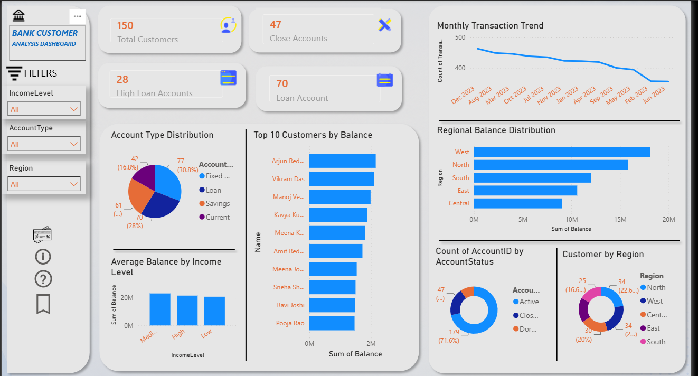

# Bank Customer Analytics Dashboard

## 📊 Project Overview

**Bank Customer Analytics Dashboard** is an end-to-end data analytics project that analyzes customer, account, and transaction data using **Python, MySQL, SQL, and Power BI**.

The project focuses on understanding customer demographics, account distribution, account status, loan accounts, regional balances, customer balances, and monthly transaction activity.

The final Power BI dashboard converts the analysis into interactive business insights and KPI visualizations.

---

## 🎯 Project Objectives

- Analyze customer demographics and regional distribution.
- Understand different account types and account statuses.
- Identify loan accounts and high-value loan accounts.
- Analyze total and average account balances.
- Compare balances across different regions.
- Analyze monthly transaction trends.
- Identify top customers based on account balance.
- Build an interactive Power BI dashboard for business reporting.

---

## Dataset

The project uses three CSV datasets:

| Dataset | Records | Main Purpose |
|---|---:|---|
| customers.csv | 150 | Customer demographic and income information |
| accounts.csv | 250 | Account type, balance, and account status |
| transactions.csv | 5,000 | Transaction date, amount, account, and transaction type |

### Customers

Main columns:

- CustomerID
- Name
- Age
- Gender
- Region
- IncomeLevel

### Accounts

Main columns:

- AccountID
- Cust_id
- AccountType
- Balance
- AccountStatus

### Transactions

Main columns:

- TransactionID
- Acc_ID
- Date
- Amount
- TransactionType

The transaction data covers **January 1, 2023 to December 31, 2023**.

---

## 🛠️ Technologies Used

- **Python**
  - Pandas
  - NumPy
  - Matplotlib
  - MySQL Connector
- **MySQL**
- **SQL**
- **Power BI**
- **Jupyter Notebook**
- **Data Cleaning**
- **Data Analysis**
- **Data Visualization**
- **Business Intelligence**

---

## 🔄 Project Workflow

CSV Datasets
     ↓
Python Data Loading & Cleaning
     ↓
MySQL Database
     ↓
SQL Queries & Business Analysis
     ↓
Power BI
     ↓
Interactive Bank Customer Analytics Dashboard

---

## 🐍 Python Analysis

The Jupyter Notebook bank_analysiis.ipynb is used for:

- Loading CSV datasets using Pandas.
- Connecting Python to MySQL.
- Reading customer, account, and transaction data from MySQL.
- Checking dataset information and descriptive statistics.
- Removing duplicate records.
- Removing missing records.
- Converting transaction dates into datetime format.
- Converting account balances into numeric values.
- Merging customer and account data.
- Performing regional balance analysis.
- Calculating KPI values.
- Creating basic Matplotlib visualizations.

---

## 🗄️ MySQL Database

The SQL script Bank_analysis_queries.sql creates a database named BI and the following tables:

### Customers

Stores customer demographic information.

### Accounts

Stores account information and links accounts to customers using Cust_id and CustomerID.

### Transactions

Stores transaction information including date, amount, account ID, and transaction type.

The SQL analysis includes:

- Record counts.
- Closed account count.
- High loan account count.
- Total balance by region.
- Average balance by income level.
- Monthly transaction trend.
- Customer count by region.
- Account type distribution.
- Top 10 customers by balance.
- Account status distribution.
- Loan account count.

---

## 📌 Key SQL Concepts

- SELECT
- WHERE
- JOIN
- GROUP BY
- ORDER BY
- HAVING
- Aggregate functions
- COUNT()
- SUM()
- AVG()
- Filtering
- Sorting
- Primary Keys
- Foreign Keys

Example relationship:

Customers.CustomerID
        │
        │
        ▼
Accounts.Cust_id

---

## 📈 Power BI Dashboard

The Power BI dashboard provides the following KPIs and visualizations:

### KPI Cards

- Total Customers
- Closed Accounts
- High Loan Accounts
- Loan Accounts

### Charts and Analysis

- **Monthly Transaction Trend**
- **Account Type Distribution**
- **Top 10 Customers by Balance**
- **Average Balance by Income Level**
- **Regional Balance Distribution**
- **Account Status Distribution**
- **Customer Distribution by Region**

### Dashboard Filters

- Income Level
- Account Type
- Region

These filters allow users to explore the dashboard based on different customer and account segments.

---

## 📊 Dashboard KPIs

The current dashboard displays:

| KPI | Value |
|---|---:|
| Total Customers | 150 |
| Closed Accounts | 47 |
| High Loan Accounts | 28 |
| Loan Accounts | 70 |

---

## 💡 Business Questions Answered

This project answers questions such as:

1. How many customers are present in the dataset?
2. How many accounts are closed?
3. How many loan accounts exist?
4. How many loan accounts have a balance greater than ₹3,00,000?
5. Which region has the highest total account balance?
6. What is the average account balance for each income level?
7. How does transaction activity change month by month?
8. How many customers belong to each region?
9. Which account type is most common?
10. Who are the top 10 customers by account balance?
11. What is the distribution of account statuses?

---

## 📁 Project Structure

Bank-Customer-Analytics/
│
├── customers.csv
├── accounts.csv
├── transactions.csv
│
├── bank_analysiis.ipynb
├── Bank_analysis_queries.sql
├── bank_cuatomer_analysiis 2.pbix
│
├── dashboard.png
└── README.md

---

## 🚀 How to Run the Project

### 1. Clone the repository

git clone <your-github-repository-url>
cd Bank-Customer-Analytics

### 2. Install Python libraries

pip install pandas numpy matplotlib mysql-connector-python jupyter

### 3. Create the MySQL database

Open MySQL and execute:

CREATE DATABASE BI;
USE BI;

Then execute the SQL script:

Bank_analysis_queries.sql

### 4. Load the datasets

Load:

customers.csv
accounts.csv
transactions.csv

into the corresponding MySQL tables.

### 5. Run the Python notebook

Open:

bank_analysiis.ipynb

and run the cells to perform data loading, cleaning, analysis, and visualization.

### 6. Open the Power BI dashboard

Open:

bank_cuatomer_analysiis 2.pbix

in Power BI Desktop.

Refresh the data/model if required and use the available filters to explore the dashboard.

---

## 🔐 Security Note

Before uploading this project to GitHub, make sure the Jupyter Notebook does **not** contain a real MySQL password or other credentials.

Use environment variables or a separate local configuration file instead of committing database credentials to GitHub.

---

## 📷 Dashboard Preview

---

## 📌 Project Outcome

This project demonstrates an end-to-end analytics workflow starting from raw CSV data and moving through **Python data cleaning, MySQL database analysis, SQL business queries, and Power BI visualization**.

It demonstrates practical skills in:

- Data cleaning
- Data preprocessing
- SQL querying
- Relational database concepts
- Data analysis
- KPI creation
- Data visualization
- Power BI dashboard development
- Business-oriented data interpretation

---

## 👨‍💻 Author

**Malay Ranjan Behera**

B.Tech – Computer Science Engineering

Skills demonstrated in this project:

**Python | SQL | MySQL | Power BI | Pandas | NumPy | Matplotlib | Data Analysis | Data Visualization | Business Intelligence**
